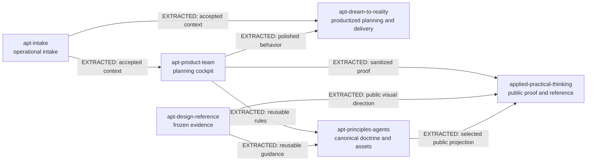
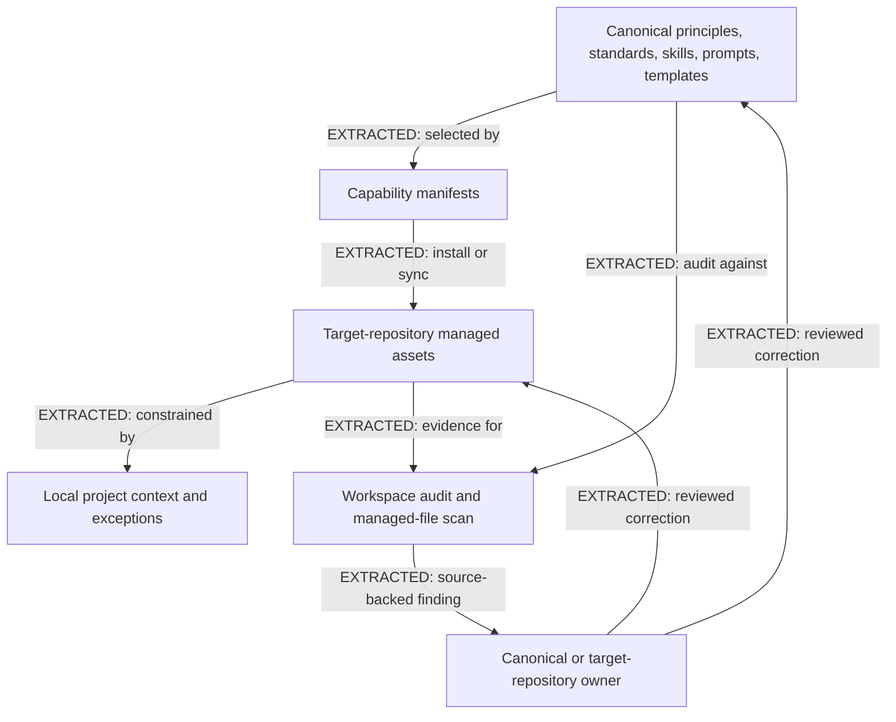
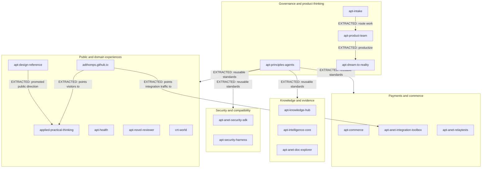

# APT Portfolio Knowledge System Diagrams

These diagrams are curated navigation aids. Canonical truth remains in the cited repository sources. Solid arrows are `EXTRACTED`: the relationship is stated explicitly in source. Dotted arrows are reserved for `INFERRED` Graphify candidates and are not promoted here without source confirmation.

## Repository Ownership And Promotion

Sources: `apt-product-team/AGENTS.md`, `apt-principles-agents/docs/intake-routing-application.md`, `apt-principles-agents/docs/working-backwards-product-team-application.md`, `apt-principles-agents/docs/design-reference-intake.md`, and `applied-practical-thinking/docs/DESIGN_REFERENCE_MERGE_DIRECTION.md`.

## Intake To Delivery And Learning

```mermaid
flowchart LR
    Report[Ambiguous or cross-product report] -->|EXTRACTED| Intake[Operational intake]
    Intake -->|EXTRACTED: route with evidence| Plan[Working Backwards planning]
    Plan -->|EXTRACTED: promotion candidate| Doctrine[Reusable doctrine, template, rubric, or contract]
    Plan -->|EXTRACTED: approved product behavior| Productized[Dream-to-Reality revisions and gates]
    Productized -->|EXTRACTED: explicit confirmation| Delivery[Engineering delivery handoff]
    Delivery -->|EXTRACTED: outcome evidence| Learning[Validation and learning]
    Learning -->|EXTRACTED: reusable lesson| Doctrine
```

Sources: `apt-intake/docs/operating-model.md`, `apt-product-team/docs/operating-model.md`, `apt-dream-to-reality/docs/INTAKE_TO_DELIVERY_CONTRACT.md`, and `apt-principles-agents/principles/execution/knowledge-and-learning.md`.

## Doctrine Distribution And Drift Review

Sources: `apt-principles-agents/README.md`, `apt-principles-agents/docs/operations/operating.md`, `apt-principles-agents/standards/installable-summaries/knowledge-graph-standards.md`, and target `.apt/installation.json` records.

## Project Families

Sources: workspace project READMEs and `docs/project-context.md` files, plus `adthomps.github.io/PROJECT_RULES.md` for gateway destinations. Family grouping is navigational; it does not imply a runtime dependency.
